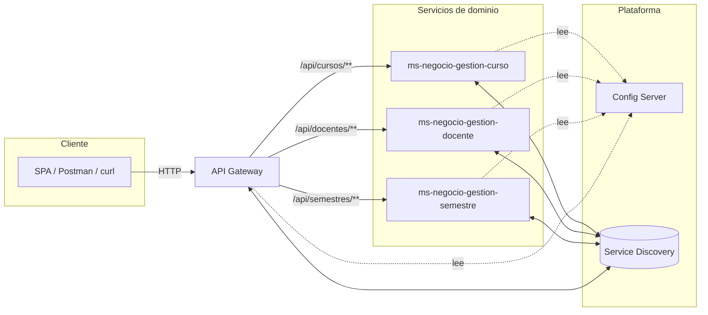

Arquitectura en microservicios 

Flujo típico de arranque
Config Server → 2) Service Discovery → 3) API Gateway → 4) Servicios de negocio (curso, docente, semestre).

Arquitectura de microservicios basada en Spring Cloud, con estos patrones/blocks:
- API Gateway como punto de entrada (carpeta ms-administration-gateway).
- Service Discovery (tipo Eureka Server) para registro/descubrimiento (ms-administration-server-record).
- Configuración centralizada con Spring Cloud Config Server (ms-administration-server-configuration) y su repo de configs (ms-administration-data-configuration).
- Servicios de dominio independientes (curso, docente, semestre), cada uno con su propio esquema/datos (scripts BD_*.sql).

# Arquitectura y README del proyecto

Este documento resume la arquitectura del repositorio **taller\_microservicio\_java\_2025**, propone un diagrama y un README listo para usar (o adaptar) en el repositorio.

---

## 1) Resumen de la arquitectura

Arquitectura de **microservicios** sobre **Spring (Boot/Cloud)** con tres bloques principales:

* **Configuración centralizada**: *Spring Cloud Config Server* (servidor) + repositorio de configuración (archivos `yml/properties`).
* **Descubrimiento de servicios**: *Service Discovery* (p. ej., Eureka Server) para registro y localización dinámica.
* **API Gateway**: *Spring Cloud Gateway* que actúa como punto único de entrada, ruteando hacia los microservicios de dominio.
* **Servicios de dominio**: `gestion-curso`, `gestion-docente`, `gestion-semestre` (cada uno independiente, con su propia capa web y acceso a datos).

**Tráfico**: *Cliente* → **Gateway** → (usa **Discovery** para resolver destinos) → **Servicios**. Todos los servicios leen su configuración desde **Config Server** al arrancar.

---

## 2) Diagrama (Mermaid)



> Si lo prefieres en PlantUML, se puede agregar una versión equivalente.

---

## 3) Estructura sugerida de módulos

```
root/
├─ ms-administration-server-configuration/   # Config Server
├─ ms-administration-data-configuration/     # Archivos de configuración (git repo)
├─ ms-administration-server-record/          # Service Discovery (Eureka)
├─ ms-administration-gateway/                # Spring Cloud Gateway
├─ ms-negocio-gestion-curso/                 # Servicio de dominio: cursos
├─ ms-negocio-gestion-docente/               # Servicio de dominio: docentes
└─ ms-negocio-gestion-semestre/              # Servicio de dominio: semestres
```

---

## 4) Orden de arranque recomendado

1. **Config Server**
2. **Service Discovery**
3. **API Gateway**
4. **Servicios de dominio** (`curso`, `docente`, `semestre`)

> Esto asegura que los servicios obtengan configuración y puedan registrarse antes de exponer rutas vía gateway.

---

## 5) Puertos & variables de entorno (ejemplo)

> Adapta estos valores a tu entorno real.

* **Config Server**: `PORT=8888`
* **Service Discovery (Eureka)**: `PORT=8761`
* **Gateway**: `PORT=8080`
* **Servicios**: `8091` (curso), `8092` (docente), `8093` (semestre)

Variables de entorno comunes:

```bash
# Config Server\ nSPRING_PROFILES_ACTIVE=native  # o git
SERVER_PORT=8888

# Eureka Server\ nSERVER_PORT=8761
EUREKA_CLIENT_REGISTER_WITH_EUREKA=false
EUREKA_CLIENT_FETCH_REGISTRY=false

# Gateway\ nSERVER_PORT=8080
SPRING_CLOUD_CONFIG_URI=http://localhost:8888
EUREKA_CLIENT_SERVICEURL_DEFAULTZONE=http://localhost:8761/eureka/

# Servicios de dominio (ejemplo curso)
SERVER_PORT=8091
SPRING_CLOUD_CONFIG_URI=http://localhost:8888
EUREKA_CLIENT_SERVICEURL_DEFAULTZONE=http://localhost:8761/eureka/
SPRING_DATASOURCE_URL=jdbc:postgresql://localhost:5432/taller
SPRING_DATASOURCE_USERNAME=postgres
SPRING_DATASOURCE_PASSWORD=postgres
```

---

## 6) Nombres de configuración (convención típica)

En `ms-administration-data-configuration` (repo de configs), se suelen tener archivos como:

```
application.yml                         # Configs compartidas
ms-administration-gateway.yml           # Config del gateway
ms-administration-server-record.yml     # Config del discovery
ms-negocio-gestion-curso.yml            # Config del servicio curso
ms-negocio-gestion-docente.yml          # Config del servicio docente
ms-negocio-gestion-semestre.yml         # Config del servicio semestre
```

Con perfiles por entorno:

```
ms-negocio-gestion-curso-dev.yml
ms-negocio-gestion-curso-qa.yml
ms-negocio-gestion-curso-prod.yml
```

> Los nombres exactos dependen del `spring.application.name` de cada módulo.

---

## 7) Ejemplo de rutas en el Gateway

```yaml
spring:
  cloud:
    gateway:
      routes:
        - id: cursos
          uri: lb://ms-negocio-gestion-curso
          predicates:
            - Path=/api/cursos/**
        - id: docentes
          uri: lb://ms-negocio-gestion-docente
          predicates:
            - Path=/api/docentes/**
        - id: semestres
          uri: lb://ms-negocio-gestion-semestre
          predicates:
            - Path=/api/semestres/**
```

> `lb://` usa Service Discovery para balancear/enrutar hacia las instancias registradas.

---

## 8) Comandos de ejecución (local)

> Ajusta `./mvnw`/`./gradlew` según el empaquetado real de cada módulo.

### 8.1 Levantar cada módulo en terminales separadas (modo desarrollo)

```bash
# 1) Config Server
cd ms-administration-server-configuration
./mvnw spring-boot:run

# 2) Discovery
cd ../ms-administration-server-record
./mvnw spring-boot:run

# 3) Gateway
cd ../ms-administration-gateway
./mvnw spring-boot:run

# 4) Servicios de dominio
cd ../ms-negocio-gestion-curso && ./mvnw spring-boot:run
cd ../ms-negocio-gestion-docente && ./mvnw spring-boot:run
cd ../ms-negocio-gestion-semestre && ./mvnw spring-boot:run
```

### 8.2 Empaquetar y ejecutar JARs

```bash
# En la raíz (o por módulo)
./mvnw -DskipTests clean package

# Ejecutar (ejemplo Config Server)
java -jar ms-administration-server-configuration/target/*.jar
```

---

## 9) Endpoints útiles y verificación

* **Eureka Dashboard**: `http://localhost:8761`
* **Gateway (health)**: `http://localhost:8080/actuator/health`
* **Servicios (health)**: `http://localhost:8091/actuator/health` (y 8092, 8093)

**Smoke tests** (si existen controladores base):

```bash
# Cursos
curl http://localhost:8080/api/cursos

# Docentes
curl http://localhost:8080/api/docentes

# Semestres
curl http://localhost:8080/api/semestres
```

---

## 10) Notas sobre base de datos

* Ejecuta los scripts SQL `BD_CURSO.sql`, `BD_DOCENTE.sql`, `BD_SEMESTRE.sql` en tu motor (p. ej., PostgreSQL).
* Asegura variables `SPRING_DATASOURCE_*` por servicio.
* Recomendado: crear bases/esquemas separados por servicio y usar migraciones (Flyway/Liquibase) en cada microservicio.

---

## 11) Observabilidad (opcional recomendado)

* **Actuator** en todos los servicios (`/actuator/health`, `/actuator/info`).
* **Tracing**: Spring Cloud Sleuth / Micrometer Tracing + OpenTelemetry Collector.
* **Logs** estructurados (JSON) y correlación via `traceId`/`spanId` propagados por el Gateway.

---

## 12) Seguridad (opcional recomendado)

* Autenticación/autorización en el **Gateway** (Spring Security + JWT, OAuth2).
* Policies de CORS en el Gateway.
* *Rate limiting* y filtros de auditoría.

---

## 13) Checklist rápido

* [ ] Config Server arriba y leyendo del repo de config
* [ ] Discovery arriba y accesible en `:8761`
* [ ] Gateway con rutas hacia los servicios
* [ ] Servicios con `spring.application.name` correcto y `eureka.client.serviceUrl`
* [ ] Datasources configurados (si aplica)
* [ ] `/actuator/health` OK en todos los módulos

---

## 14) Próximos pasos (si quieres dejarlo en el README del repo)

1. Añadir **diagrama** (este Mermaid) al README.
2. Añadir sección **Cómo ejecutar** con el orden de arranque y los comandos.
3. Incluir **tabla de endpoints** de cada microservicio (CRUD básicos, ejemplos `curl`).
4. Agregar **.env** y **docker-compose** (opcional) para DB y configuración local.
5. Integrar **Flyway** por servicio para versionar el esquema.
6. Añadir **tests** de contrato (OpenAPI + Spring Cloud Contract) y **smoke tests**.
